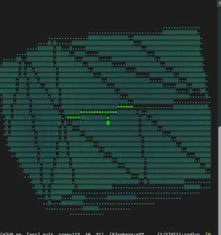

# vcgame
*[Nate MacFadden](https://github.com/natemacfadden), Liam McAllister Group, Cornell*

<p align="center"></p>

An interactive terminal game built around *vector configurations* and their *triangulations*.

The player navigates a simplicial fan (a triangulation of a 3D lattice vector configuration)
by moving along geodesics on the 2-sphere. Crossing a wall between cones performs a
**bistellar flip**, modifying the triangulation in real time. The fan can be locked for
free exploration without flipping.

Requires [regfans](https://github.com/natemacfadden/regfans) and numpy. pynput is recommended for best key input handling but the game falls back to terminal input if unavailable.

## Project structure

The pipeline has three stages, each independent:

```
shapes/      stage 1 (generate integer vectors and triangulate into a fan)
renderer/    stage 2 (ASCII rendering of a fan, no game state)
game/        stage 3 (interactive game loop, player, agents)
```

Stages can be used independently. For example, stages 1 and 2 together support
generating, rendering, and saving shapes without any game logic.

## Running the game

```bash
python main.py
python main.py --shape trunc_oct
python main.py --shape random --seed 42
python main.py --shape reflexive --polytope_id 7
python main.py --shape cube --n 5 --color 1
```

### Available shapes

| Name | Description | Parameters |
|---|---|---|
| `cube` | Boundary lattice points of an n×n×n integer cube | `--n` (odd, ≥ 3, **required**) |
| `random` | Random centrally-symmetric lattice vectors on convex hull | `--seed` |
| `reflexive` | Lattice points of a 3D reflexive polytope (4319 available) | `--polytope_id` (0–4318) |
| `trunc_oct` | Vertices of the truncated octahedron | none |

## Development note

This project was developed with the assistance of
[Claude Code](https://claude.ai/claude-code) (Anthropic), as a test/warm-up project for
semi-hands-off agentic software development for projects semi-close to research.
